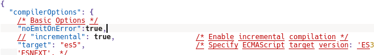

<h1>TypeScript compilador</h1>
<h2>Opcoes a serem colocadas ou habilitadas no tsconfig.json</h2>
<h3>Opcao noEmitOnError = true</h3>
 
A mesma deve ser colocada junto com as outras opcoes. Dentro da propriedade compilerOptions. Por padrao essa
opcao nao esta la, mas pode ser adicionado as configuracoes do compilador se necessario. Ela nao gera arquivo javascript, caso
possua erros no typescript, para isso basta colocar como um atributo
no json, ficando '<b>"noEmitOnError":true</b>'
<h3>Target</h3>
A propriedade target define o arquivo de saida JS, no caso voce especifica quais tecnologias geradas o arquivo de saida pode conter,
por padrao vem o es5 e por exemplo nesse padrao nao tinha o let, logo todas as variaveis criadas saem com o var, ao inves do let
quando a mesma eh criada. Agora se mudar para es6 ai o let comeca a aparecer por exemplo, essa opcao tem sim la no json e pode ser habilitada.
ficando: '<b>"target":"es5"</b>'

<h2>Uso</h2>
<h3>tsc [seu arquivo]</h3>
Compila o arquivo transformando-o em javascript. O <b>[seu arquivo]</b> deve ser substituido pelo arquivo a ser compilado.
<h3>tsc -init</h3>
cria um arquivo json padrao com muitas opcoes comentadas. Esse arquivo define o funcionamento do compilador.
<h3>tsc -w [arquivo.ts]</h3>
Monitora um arquivo e compila quando uma alteracao eh feita. O <b>[arquivo.ts]</b> deve ser substituido pelo arquivo a ser moniorado.
