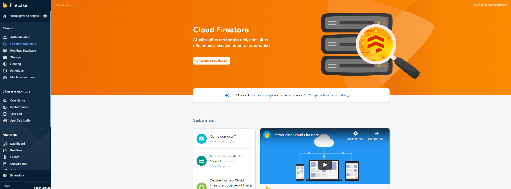
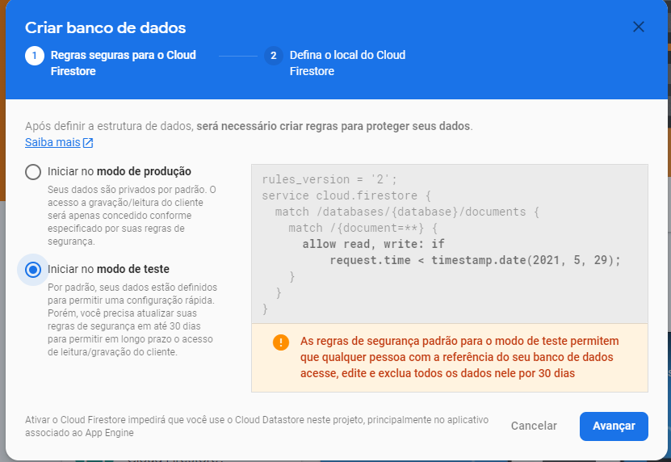
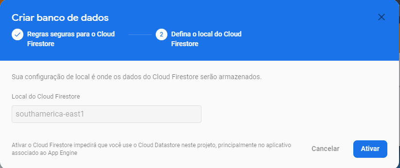
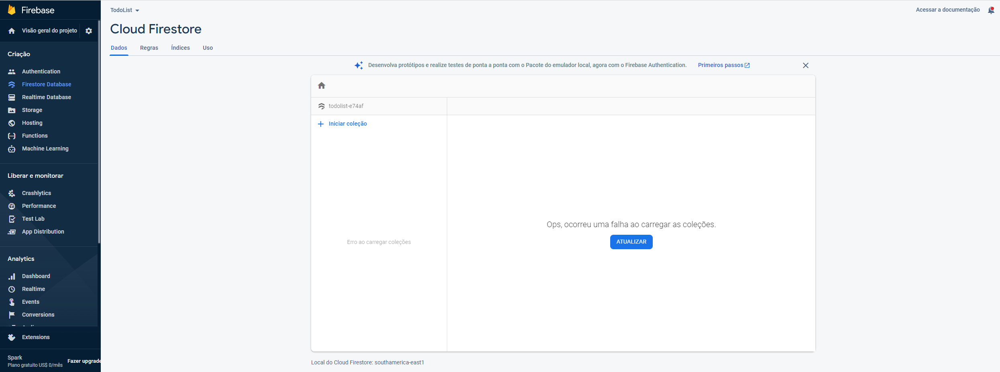

# Cloud Firestore
>O Cloud Firestore é o novo banco de dados do Firebase. Ele seria uma evolução em relação ao Realtime database, permitindo consultas mais complexas e trazendo melhorias de escalabilidade. Assim como o Realtime Database, ele é um banco de dados NoSQL na nuvem que possibilita a sincronização de dados em tempo real no formato JSON, mas nesse caso, é um NoSQL do tipo documentos e, dessa forma, possibilitando uma estruturação dos dados através de coleções e documentos.

## Indices
[1. Instalação](#setup)

## Setup

**Para começar você deve clicar na opção `Firestore Database` e depois clicar no botão `Criar banco de dados`, conforme ilustrado abaixo:**

**Aqui abaixo definimos se queremos criar um banco para produção ou desenvolvimento, no caso se marcado a opção *Iniciar no modo de teste* você criara um banco de dados com regras mais flexíveis.**

**Aqui é definido o local aonde deve ficar armazenado o banco de dados, no caso a localização física do servidor.**

**Por fim temos abaixo a conclusão do processo acima, ao menos até agora é normal aparecer esse erro, no caso trata-se de um bug.**

