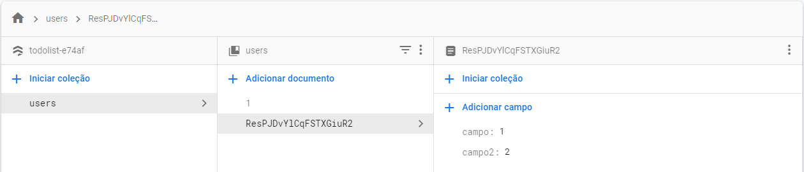
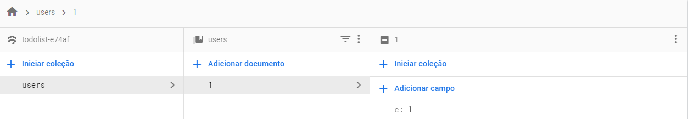

# Cloud Firestore
>O Cloud Firestore é o novo banco de dados do Firebase. Ele seria uma evolução em relação ao Realtime database, permitindo consultas mais complexas e trazendo melhorias de escalabilidade. Assim como o Realtime Database, ele é um banco de dados NoSQL na nuvem que possibilita a sincronização de dados em tempo real no formato JSON, mas nesse caso, é um NoSQL do tipo documentos e, dessa forma, possibilitando uma estruturação dos dados através de coleções e documentos.

[Documentação](https://firebase.google.com/docs/firestore)
## Indices
[1. Instalação](#setup)

[2. Inserindo dados](#adicionando-dados)

## Setup

**Para começar você deve clicar na opção `Firestore Database` e depois clicar no botão `Criar banco de dados`, conforme ilustrado abaixo:**

**Aqui abaixo definimos se queremos criar um banco para produção ou desenvolvimento, no caso se marcado a opção *Iniciar no modo de teste* você criara um banco de dados com regras mais flexíveis.**

**Aqui é definido o local aonde deve ficar armazenado o banco de dados, no caso a localização física do servidor.**

**Por fim temos abaixo a conclusão do processo acima, ao menos até agora é normal aparecer esse erro, no caso trata-se de um bug.**

[Documentação](https://firebase.google.com/docs/firestore/quickstart)
### Adicionando na página
Após feito a configuração no console, você incluir isso no seu código ``, esse script carrega o conteúdo referente ao `firestore`, que será melhor analisado aqui.
## Adicionando dados
[Exemplo](js/todo.js)    

[Documentação](https://firebase.google.com/docs/firestore/manage-data/add-data)
###### Cloud Storage
    database
        .ref('users')
        .child(firebase.auth().currentUser.uid)
        .push(data)
        .then(
            function () {
                console.log('Tarefa "' + data.name + '" adicionada com sucesso')
        }).catch(
            function (error) {
                showError('Falha ao adicionar tarefa (use no máximo 30 caracteres): ', error)
        })

###### Firebase  
    firebase
        .firestore()        
        .collection('tarefas')
        .add(dados)
        .then(
            function () {
                console.log('Tarefa "' + data.name + '" adicionada com sucesso')
            })
        .catch(
            function (error) {
                console.log('Falha ao adicionar tarefa (use no máximo 30 caracteres): ', error)
        })

### Método add
Aqui lidamos com documentos, no caso nessa parte do código `.collection('tarefas')` estamos dizendo aonde devemos adicionar esse dado, uma vez feito isso você usa o método `add` para adicionar os dados a coleção do usuário, conforme visto aqui `.add(dados)`.

>Às vezes não há um ID significativo para o documento. É mais prático que o Cloud Firestore gere um automaticamente para você. Para fazer isso, basta chamar add():

Ou seja esse método é útil quando você quer adicionar um novo registro com um identificador único, esse método cuida de adicionar esse identificador único, esse é o seu diferencial.

###### Exemplo add
    // Adicione um novo documento com um ID gerado.

    ...
    .collection("cities").add({
        name: "Tokyo",
        country: "Japan"
    })
    .then((docRef) => {
        console.log("Documento escrito com id: ", docRef.id);
    })
    .catch((error) => {
        console.error("Erro ao adicionar documento: ", error);
    });

#### Método add na prática
    firebase.firestore().collection("users").add({campo:1,campo2:2})

Nesse caso foi criado com o seguinte *id*:`ResPJDvYlCqFSTXGiuR2`, ou seja diferente do documento com o id de `1`, esse foi criado de maneira dinâmica. 
### Método set
>Ao usar set() para criar um documento, você precisa especificar um ID para ele.
    ...
    .collection("cities")
    .doc("new-city-id")
    .set({
        name: "Tokyo",
        country: "Japan"
    })
    .then((docRef) => {
        console.log("Documento escrito com id: ", docRef.id);
    })
    .catch((error) => {
        console.error("Erro ao adicionar documento: ", error);
    });

A grande diferença do `add` para o `set`, é que no *set* você deve definir um *uid* manualmente no método doc, conforme visto aqui `.doc("new-city-id")`, ao passo que o `add` gerencia isso sozinho o `set`, exija que você o faça, manualmente, o que pode ser útil caso você queira definir um identificador único de maneira manual, no caso do `set` você usa o `doc` no encadeamento antes do `set`, para que possar ser definido o id de maneira manual.

### Usando .doc
    firebase.firestore().collection("users").doc('1').set({c:1})

**Nesse exemplo acima, ao qual a imagem corresponde ao resultado da promise acima, é usado o `.doc` para a definição de id.**
