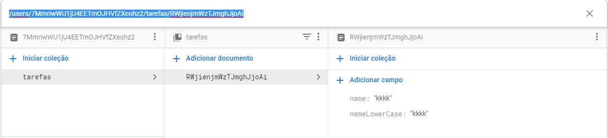
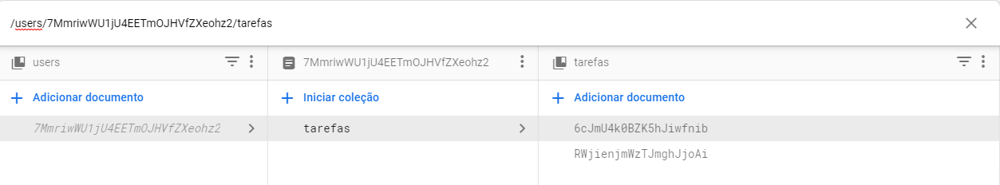
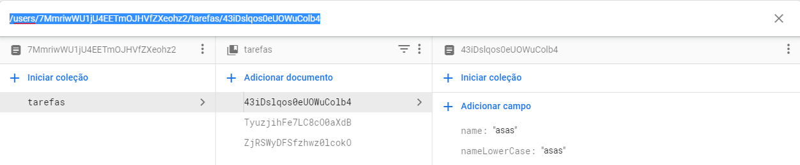
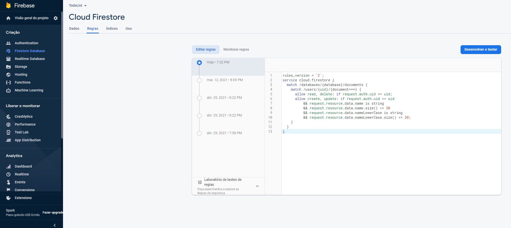

# Cloud Firestore
>O Cloud Firestore é o novo banco de dados do Firebase. Ele seria uma evolução em relação ao Realtime database, permitindo consultas mais complexas e trazendo melhorias de escalabilidade. Assim como o Realtime Database, ele é um banco de dados NoSQL na nuvem que possibilita a sincronização de dados em tempo real no formato JSON, mas nesse caso, é um NoSQL do tipo documentos e, dessa forma, possibilitando uma estruturação dos dados através de coleções e documentos.

[Documentação](https://firebase.google.com/docs/firestore)

[Acessar dados off-line](https://firebase.google.com/docs/firestore/manage-data/enable-offline?hl=pt-br)
## Indices
[1. Instalação](#setup)

[2. Inserindo dados](#adicionando-dados)

[3. Buscando dados](#buscando-dados)

[4. Excluindo dados](#excluindo-dados)

[5. Alterando dados](#alterando-dados)

## Setup

**Para começar você deve clicar na opção `Firestore Database` e depois clicar no botão `Criar banco de dados`, conforme ilustrado abaixo:**

**Aqui abaixo definimos se queremos criar um banco para produção ou desenvolvimento, no caso se marcado a opção *Iniciar no modo de teste* você criara um banco de dados com regras mais flexíveis.**

**Aqui é definido o local aonde deve ficar armazenado o banco de dados, no caso a localização física do servidor.**

**Por fim temos abaixo a conclusão do processo acima, ao menos até agora é normal aparecer esse erro, no caso trata-se de um bug.**

[Documentação](https://firebase.google.com/docs/firestore/quickstart)
### Adicionando na página
Após feito a configuração no console, você incluir isso no seu código ``, esse script carrega o conteúdo referente ao `firestore`, que será melhor analisado aqui.
## Adicionando dados
[Exemplo](js/todo.js)    

[Documentação](https://firebase.google.com/docs/firestore/manage-data/add-data)
###### Cloud Storage
    database
        .ref('users')
        .child(firebase.auth().currentUser.uid)
        .push(data)
        .then(
            function () {
                console.log('Tarefa "' + data.name + '" adicionada com sucesso')
        }).catch(
            function (error) {
                showError('Falha ao adicionar tarefa (use no máximo 30 caracteres): ', error)
        })

###### Firebase  
    firebase
        .firestore()        
        .collection('tarefas')
        .add(dados)
        .then(
            function () {
                console.log('Tarefa "' + data.name + '" adicionada com sucesso')
            })
        .catch(
            function (error) {
                console.log('Falha ao adicionar tarefa (use no máximo 30 caracteres): ', error)
        })

### Método add
Aqui lidamos com documentos, no caso nessa parte do código `.collection('tarefas')` estamos dizendo aonde devemos adicionar esse dado, uma vez feito isso você usa o método `add` para adicionar os dados a coleção do usuário, conforme visto aqui `.add(dados)`.

>Às vezes não há um ID significativo para o documento. É mais prático que o Cloud Firestore gere um automaticamente para você. Para fazer isso, basta chamar add():

Ou seja esse método é útil quando você quer adicionar um novo registro com um identificador único, esse método cuida de adicionar esse identificador único, esse é o seu diferencial.

###### Exemplo add
    // Adicione um novo documento com um ID gerado.

    ...
    .collection("cities").add({
        name: "Tokyo",
        country: "Japan"
    })
    .then((docRef) => {
        console.log("Documento escrito com id: ", docRef.id);
    })
    .catch((error) => {
        console.error("Erro ao adicionar documento: ", error);
    });

#### Método add na prática
    firebase.firestore().collection("users").add({campo:1,campo2:2})

Nesse caso foi criado com o seguinte *id*:`ResPJDvYlCqFSTXGiuR2`, ou seja diferente do documento com o id de `1`, esse foi criado de maneira dinâmica. 
### Método set
>Ao usar set() para criar um documento, você precisa especificar um ID para ele.
    ...
    .collection("cities")
    .doc("new-city-id")
    .set({
        name: "Tokyo",
        country: "Japan"
    })
    .then((docRef) => {
        console.log("Documento escrito com id: ", docRef.id);
    })
    .catch((error) => {
        console.error("Erro ao adicionar documento: ", error);
    });

A grande diferença do `add` para o `set`, é que no *set* você deve definir um *uid* manualmente no método doc, conforme visto aqui `.doc("new-city-id")`, ao passo que o `add` gerencia isso sozinho o `set`, exija que você o faça, manualmente, o que pode ser útil caso você queira definir um identificador único de maneira manual, no caso do `set` você usa o `doc` no encadeamento antes do `set`, para que possar ser definido o id de maneira manual.

### Usando .doc
    firebase.firestore().collection("users").doc('1').set({c:1})

**Nesse exemplo acima, ao qual a imagem corresponde ao resultado da promise acima, é usado o `.doc` para a definição de id.**

## Buscando dados
    firebase.firestore().collection('users').doc(firebase.auth().currentUser.uid).collection('tarefas').onSnapshot(e => e.forEach(f => console.log(f.data())))
**Será exibido no console esse path**

[Documentação](https://firebase.google.com/docs/firestore/data-model)
### doc
>No Cloud Firestore, a unidade de armazenamento é o documento. Um documento é um registro leve que contém campos, que são mapeados para valores. Cada documento é identificado por um nome. Um documento que representa um usuário alovelace pode ser assim:

<ul style="border:2px solid #CCC;background-color:#DDD;border-radius:5px;">
    <li>first : "Ada"</li>
    <li>last : "Lovelace"</li>
    <li>born : 1815</li>
</ul>

<strong>Observação:</strong> o Cloud Firestore é compatível com vários tipos de dados de valores: booleano, número, string, ponto geográfico, blob binário e carimbo de data/hora. Use arrays ou objetos aninhados, chamados mapas, para estruturar dados em um documento.

>Objetos complexos e aninhados em um documento são chamados de mapas. Por exemplo, é possível estruturar o nome do usuário do exemplo acima com um mapa, como este:

<ul style="border:2px solid #CCC;background-color:#DDD;border-radius:5px;">
    <li>
        alovelace
    </li>
    <ul>
        <li>name :</li>
        <ul>
            <li>first : "Ada"</li>
            <li>last : "Lovelace"</li>
        </ul>
        <li>born : 1815</li>
    </ul>
</ul>

>Observe que os documentos parecem muito com documentos JSON. Na verdade, basicamente eles são. Há algumas diferenças, por exemplo, os documentos são compatíveis com tipos de dados extras e têm o tamanho limitado a 1 MB, no entanto, geralmente eles podem ser tratados como registros JSON leves.

### collection
Esse método busca uma coleção, você informa o nome da coleção que deseja buscar. [Documentação](https://firebase.google.com/docs/firestore/data-model#collections).

>Os documentos pertencem a coleções, que são simplesmente recipientes para documentos. Por exemplo, é possível ter uma coleção users para conter seus vários usuários, cada um representado por um documento:

<ul style="border:2px solid #CCC;background-color:#DDD;border-radius:5px;">
    <h3>Usuários</h3>
    <li>
        alovelace
        <ul>
            <li>first : "Ada"</li>
            <li>last : "Lovelace"</li>
            <li>born : 1815</li>
        </ul>
    </li>
    <li>
        aturing
        <ul>
            <li>first : "Alan"</li>
            <li>last : "Turing"</li>
            <li>born : 1912</li>
        </ul>
    </li>
</ul>

>O Cloud Firestore não usa esquemas. Portanto, você tem total liberdade sobre quais os campos colocar em cada documento e que tipos de dados armazenar nesses campos. Os documentos dentro da mesma coleção podem conter diferentes campos ou armazenar diferentes tipos de dados nesses campos. No entanto, é recomendável usar os mesmos campos e tipos de dados em vários documentos para que seja possível consultar os documentos com mais facilidade.

>Uma coleção não contém nada além de documentos. Não pode conter diretamente campos brutos com valores e não pode conter outras coleções. (Consulte [Dados hierárquicos](https://firebase.google.com/docs/firestore/data-model#hierarchical-data) para saber mais sobre como estruturar dados complexos no Cloud Firestore.)

>Os nomes dos documentos dentro de uma coleção são únicos. Forneça suas próprias chaves, como IDs de usuário, ou permita que o Cloud Firestore crie automaticamente IDs aleatórios para você.

>Não é preciso "criar" ou "excluir" coleções. Depois de criar o primeiro documento em uma coleção, ela passa a existir. Se você excluir todos os documentos em uma coleção, ela deixará de existir.

### onSnapshot
[Documentação](https://firebase.google.com/docs/firestore/query-data/listen?hl=pt-br)

>É possível detectar um documento com o método onSnapshot(). Uma chamada inicial usando o retorno de chamada fornecido cria imediatamente um snapshot do documento com o conteúdo atual do documento único. Depois, sempre que o conteúdo muda, outra chamada atualiza o snapshot do documento.
    firebase.firestore().collection('users').doc(firebase.auth().currentUser.uid).collection('tarefas').onSnapshot(e => e.forEach(f => console.log(f.data())));

### get
[Documentação](https://firebase.google.com/docs/firestore/query-data/get-data?hl=pt-br)

    firebase.firestore().collection('users').doc(firebase.auth().currentUser.uid).collection('tarefas').doc('43iDslqos0eUOWuColb4').get().then(d => console.log(d.data()))

**Usando o método `get` você consegue pegar um registo no firestore, repare que a estrutura segue igual, porém no caso ele retorna um objeto, ou seja ele retorna o valor armazenado na nuvem em forma de objeto javascript, nesse trecho de código `.get().then(d => console.log(d.data()))`. No caso ele vai resgatar os dados de `43iDslqos0eUOWuColb4`.**

## Excluindo dados
[Documentação para exclusão](https://firebase.google.com/docs/firestore/manage-data/delete-data?hl=pt-br)
###### Exemplo envolvendo exclusão, com base nesse projeto
    firebase.firestore().collection('users').doc(firebase.auth().currentUser.uid).collection('tarefas').doc('6cJmU4k0BZK5hJiwfnib').delete()

O método acima retorna uma promise, ou seja é perfeitamente possível encadear um `then` ou um `catch`, para iniciar a exclusão você acerta o *PATH* e ao final engata um *delete*, o delete não passa um parametro para o `then`, caso de tudo certo e passa um objeto de erro quando ocorre algo para dar um `catch`.

>Quando você exclui um documento, o Cloud Firestore não remove automaticamente os documentos nas subcoleções dele. Ainda é possível acessar os documentos da subcoleção para fins de consulta. Por exemplo, é possível acessar o documento no caminho /mycoll/mydoc/mysubcoll/mysubdoc, mesmo se você excluir o documento ancestral em /mycoll/mydoc.

>Os documentos ancestrais inexistentes são exibidos no console, mas não aparecem nos resultados de consulta e snapshots.

>Se quiser excluir um documento e todos os que estão contidos nas subcoleções dele, você precisará fazer isso manualmente.

## Alterando dados
[Documentação](https://firebase.google.com/docs/firestore/manage-data/transactions?hl=pt-br)
###### Exemplo envolvendo atualização com update
    firebase.firestore().collection('users').doc(firebase.auth().currentUser.uid).collection('tarefas').doc('ZjUnI2iD4euAdS8rVY6R').update({name:'look'})
###### Exemplo envolvendo atualização com set
    firebase.firestore().collection('users').doc(firebase.auth().currentUser.uid).collection('tarefas').doc('pk4ETDz4kmVe1RJxJdbf').set({name1:'look1'})
### update
Para se alterar você pode usar o `update`, no caso o `update` faz a atualização **SEM** mudar a estrutura, nesse exemplo acima, se existir um campo *name*, ele simplesmente substitui o valor do campo *name*, caso não exista, é criado um novo campo chamado *name* e com esse valor informado nessa promise.

### set
O set faz a atualização alterando a estrutura, no caso o objeto armazenado no servidor é **substituido** pelo objeto passado, no caso, independente do valor que tenha em `pk4ETDz4kmVe1RJxJdbf`, uma vez executada essa *promise* a estrutura do dado passa a ser exatamente essa `{name1:'look1'}`, ou seja o `set` vai no sentido de alterar a estrutura do dado também. Pode ser útil tanto para alterar, como para adicionar, conforme [visto aqui](#método-set).

## Regras de segurança

    rules_version = '2';
    service cloud.firestore {
        match /databases/{database}/documents {
            match /users/{uid}/{document=**} {
            allow read, delete: if request.auth.uid == uid;
            allow create, update: if request.auth.uid == uid
                    && request.resource.data.name is string
                && request.resource.data.name.size() <= 30
                && request.resource.data.nameLowerCase is string
                && request.resource.data.nameLowerCase.size() <= 30;
            }
        }
    }

Com relação a regras de segurança, vale o mesmo para os outros serviço do firestore. [Documentação](https://firebase.google.com/docs/rules?authuser=0)