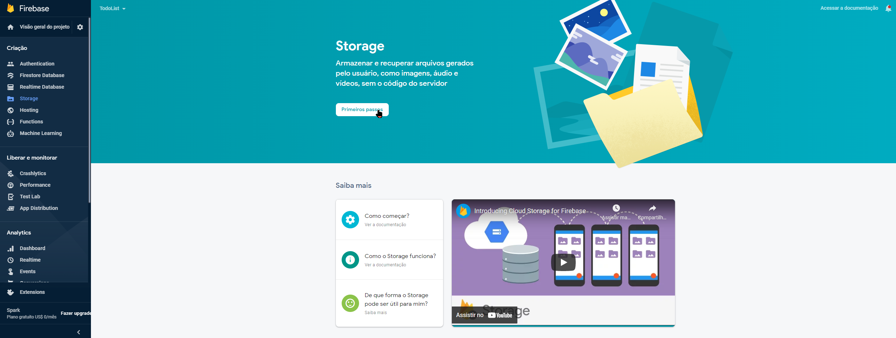
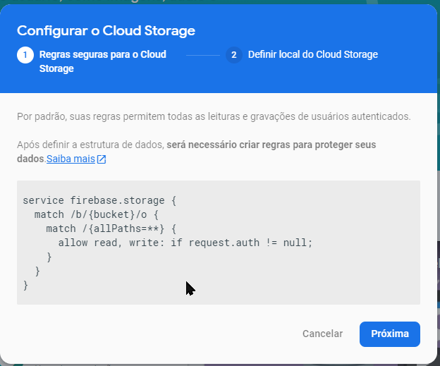
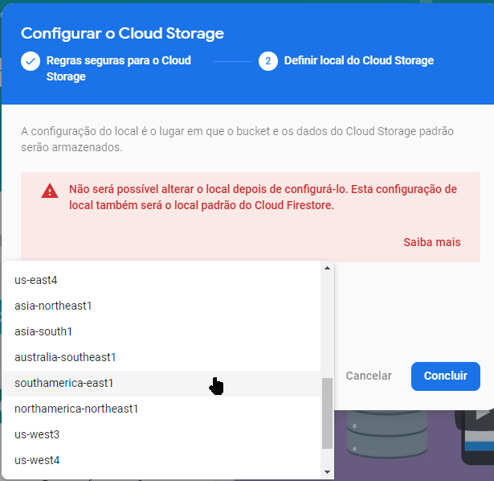
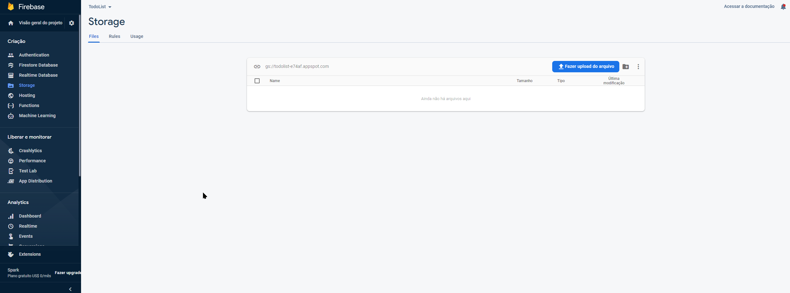
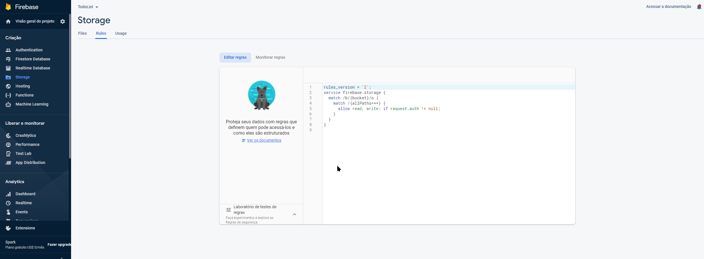
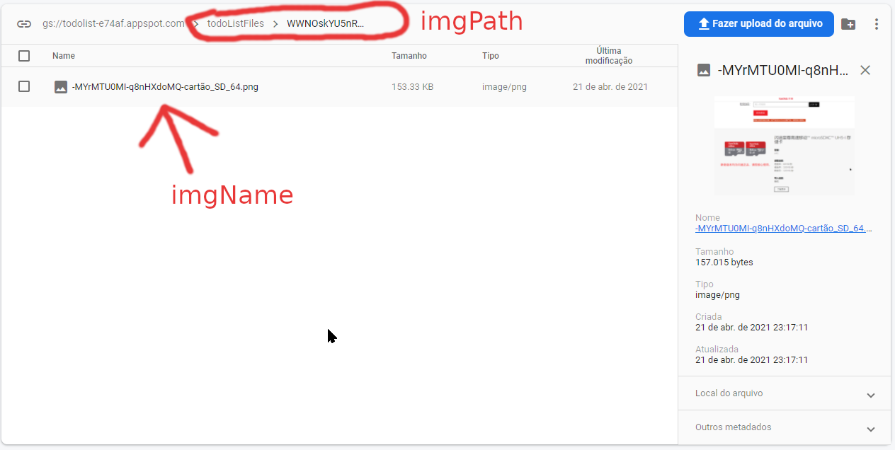

# Cloud Storage
[Documentação em português](https://firebase.google.com/docs/storage/web/upload-files?hl=pt-br)

[1. Criando um novo Storage](#criando-no-console)

[2. Acessando o Storage](#acessando-storage)

[3. Gerenciando Uploads e Downloads](#gerenciando-uploads-e-downloads)

[4. Excluido Registro](#delete)

## Criando no console
**Inicialmente você vai no menu e clica em `Storage`, e você verá algo assim:**

**Feito isso você pode definir aqui as regras de segurança se você desejar ou, você pode fazer isso mais a frente.**

**Após isso você deve definir a localização do servidor, cuidado para não escolher um servidor muito distante, pois isso pode aumentar a latência.**

**Aqui ficará os seus arquivos:**

**Aqui você edita as suas regras**

### Colocando o script no arquivo HTML
Para que tudo funcione, você precisa colocar esse script no seu html ``, aqui conterá todas as instruções para carregar toda a funcionalidade do Storage.

## Acessando Storage

[Documentação](https://firebase.google.com/docs/reference/js/firebase.storage)

[Documentação UploadTask](https://firebase.google.com/docs/reference/js/firebase.storage.UploadTask)

[Documentação UploadMetadata](https://firebase.google.com/docs/reference/js/firebase.storage.UploadMetadata)

###### Método Storage Assinatura
    storage ( app ? :  App ) : Storage

>Obtem o serviço de `Storage` padrão do app ou retorna um app. `firebase.storage()` pode ser chamado sem argumentos para acessar o `app` padrão de serviço de armazenamento ou como `firebase.storage(app)` para acessar o serviço de armazenamento associado a um app específico.

###### Exemplo de upload de arquivo
[todo.js](js/todo.js)

    var file = todoForm.file.files[0] // Seleciona o primeiro aquivo da seleção de aquivos

    if (file != null) { // Verifica se o arquivo foi selecionado
      if (file.type.includes('image')) { // Verifica se o arquivo é uma imagem
        // Compõe o nome do arquivo
        var imgName = firebase.database().ref().push().key + '-' + file.name
        // Compõe o caminho do arquivo
        var imgPath = 'todoListFiles /' + firebase.auth().currentUser.uid + '/' + imgName

        // Cria uma referência de arquivo usando o caminho criado na linha acima
        var storageRef = firebase.storage().ref(imgPath)
        
        // Inicia o processo de upload
        storageRef.put(file)
      }
    }

**Aqui `var imgName = firebase.database().ref().push().key` você pega uma chave criado pelo método PUSH, no caso essa expressão cria uma chave que será usado para compor o nome do arquivo, uma vez feito isso, a próxima instrução é a criação do *PATH*, conforme visto aqui: `var imgPath = 'todoListFiles /' + firebase.auth().currentUser.uid + '/' + imgName`, nesse caso será criado um path aonde `imgName` será usado para o nome do arquivo e `imgPath` para criar um caminho, conforme ilustrado abaixo:**

**Uma vez feito isso, você deve usar o método storage para fazer o upload, aqui você cria uma referência `var storageRef = firebase.storage().ref(imgPath)` com base no *PATH* e por fim você deve usar o método `put` para fazer upload, sendo `firebase.storage().ref(imgPath).put(file)`, ou seguindo a lógica do código acima:**

    // Cria uma referência de arquivo usando o caminho criado na linha acima
        var storageRef = firebase.storage().ref(imgPath)
        
    // Inicia o processo de upload
        storageRef.put(file)

## Gerenciando Uploads e Downloads
[Documentação traduzida do upload](https://firebase.google.com/docs/storage/web/upload-files?hl=pt-br)

>Para fazer upload de um arquivo para o Cloud Storage, primeiro crie uma referência ao caminho completo do arquivo, incluindo o nome dele.
###### Exemplo de upload
[Documentação](https://firebase.google.com/docs/storage/web/upload-files?hl=pt-br#upload_files)

    // Crie uma referência de raiz
    var storageRef = firebase.storage().ref();

    // Criar uma referência a 'mountains.jpg'
    var mountainsRef = storageRef.child('mountains.jpg');

    // Criar uma referência a 'images/mountains.jpg'
    var mountainImagesRef = storageRef.child('images/mountains.jpg');

    // Enquanto os nomes dos arquivos são os mesmos, as referências apontam para arquivos diferentes

    mountainsRef.name === mountainImagesRef.name            // true
    mountainsRef.fullPath === mountainImagesRef.fullPath    // false

#### Fazendo upload de um Blob ou File   
[Documentação](https://firebase.google.com/docs/storage/web/upload-files?hl=pt-br#upload_from_a_blob_or_file)

>Depois de criar uma referência apropriada, chame o método put(). O put() usa os arquivos por meio das APIs File e Blob do JavaScript e faz upload deles para o Cloud Storage.

    var file = ... // Use a API de blob ou arquivo
    ref.put(file).then(function(snapshot) {
        console.log('Uploaded a blob or file!');
    });

#### Upload de um Byte Array
[Documentação](https://firebase.google.com/docs/storage/web/upload-files?hl=pt-br#upload_from_a_byte_array)

>Além dos tipos File e Blob, o put() também pode fazer upload de um Uint8Array para o Cloud Storage.

    // Uint8Array
    var bytes = new Uint8Array([0x48, 0x65, 0x6c, 0x6c, 0x6f, 0x2c, 0x20, 0x77, 0x6f, 0x72, 0x6c, 0x64, 0x21]);
    ref.put(bytes).then(function(snapshot) {
        console.log('Uploaded an array!');
    });

#### Upload de uma string
[Documentação](https://firebase.google.com/docs/storage/web/upload-files?hl=pt-br#upload_from_a_string)

>Se um Blob , File ou Uint8Array não estiver disponível, você pode usar o putString() para fazer o upload de uma string bruta codificada base64 , base64url ou data_url para o Cloud Storage.

    // Raw string é o padrão se nenhum formato for fornecido
    var message = 'This is my message.';
    ref.putString(message).then(function(snapshot) {
      console.log('Uploaded a raw string!');
    });

    // Base64 string formatada
    var message = '5b6p5Y+344GX44G+44GX44Gf77yB44GK44KB44Gn44Go44GG77yB';
    ref.putString(message, 'base64').then(function(snapshot) {
      console.log('Uploaded a base64 string!');
    });

    // Base64url string formatada
    var message = '5b6p5Y-344GX44G-44GX44Gf77yB44GK44KB44Gn44Go44GG77yB';
    ref.putString(message, 'base64url').then(function(snapshot) {
      console.log('Uploaded a base64url string!');
    });

    // Data URL string
    var message = 'data:text/plain;base64,5b6p5Y+344GX44G   +44GX44Gf77yB44GK44KB44Gn44Go44GG77yB';
    ref.putString(message, 'data_url').then(function(snapshot) {
      console.log('Uploaded a data_url string!');
    });

### Método Put
    put ( data :  Blob | Uint8Array | ArrayBuffer ,  metadata ? :  UploadMetadata ) : UploadTask

>Carrega dados para a localização desta referência.

#### Parametros
    data: Blob | Uint8Array | ArrayBuffer
    Os dados para upload.

    Opcional metadata: UploadMetadata
    Metadados para o objeto recém-enviado.

#### Retorna UploadTask
    Um objeto que pode ser usado para monitorar e gerenciar o upload.

>put() e putString() retornam um UploadTask que pode ser usado como uma promessa ou para gerenciar e monitorar o status do upload.

>Como a referência define o caminho completo do arquivo, certifique-se de que você esteja fazendo upload para um caminho não vazio.

### Barra de progresso com uploads
[Documentação de firebase.storage.UploadTask](https://firebase.google.com/docs/reference/js/firebase.storage.UploadTask)

**Aqui usaremos um exemplo com o método `put` do método `ref`, que por sua vez vem do método `storage` que que é um método do objeto do `firebase`.**

    var storageRef = firebase.storage().ref(imgPath)
    var upload = storageRef.put(file)
    trackUpload(upload)

**O gerenciamento será melhor visto dentro dessa função `trackUpload(upload)`, no caso é passado como parametro `trackUpload(firebase.storage().ref(imgPath).put(file))`, a `imgPath` foi explicado melhor acima e o `file`, é um atributo pego do formulário, conforme visto aqui `var file = todoForm.file.files[0]`,ou seja `trackUpload(firebase.storage().ref([PATH]).put([FILE]))`, `[PATH]` corresponde ao Path da coleção, conforme [visto aqui](#exemplo-de-upload-de-arquivo) e o `[File]` correspondendo ao input do tipo `file` no formulário.**

###### Gerenciando upload, função trackUpload - código de trackUpload

    //Rastreia o progresso de upload e Gerencia
    function trackUpload(upload){
        showItem(progressFeedBack);
        upload.on('state_changed', 
            function(snapshot){ //Segundo argumento: Recebe informações, sobre o upload
                console.log(snapshot);
                var status = (snapshot.bytesTransferred / snapshot.totalBytes * 100).toFixed(2) + "%";
                console.log(status)
                ProgressEvent.value = status;
            },
            function(error){//terceiro argumento: Executando quando ocorre erro.
                console.log(error);
                showError("Houve uma falha no upload da imagem!",error )
                hideItem(progressFeedBack);
            },
            function(){ //Executado caso tudo de certo.
                console.log("Sucesso no upload");
                hideItem(progressFeedBack);
            })

        //Pausar e retomar
        var playPauseUpload = true //Estado de controle do upload (pausado ou em andamento)
        playPauseBtn.onclick = function(){ //Botao pausar/continuar de upload quando clicado.
            playPauseUpload = !playPauseUpload; //inverte o estado de controle do upload
            if(playPauseUpload){ //Se deseja retomar o upload.
                upload.resume(); //Retoma o upload
                playPauseBtn.innerText = "Pausar";
                console.log("upload retomado");
            }else{ //Se deseja pausar o upload.
                upload.pause(); //Pausar o upload
                playPauseBtn.innerText = "Continuar";
                console.log('upload pausado');
            }
        }

        //Cancelar
        cancelBtn.onclick = function(){ //Botão para cancelar upload clicado
            (confirm('Deseja realmente cancelar o upload')) && upload.cancel(); //Cancela o upload
        }
    }

### Método on    
    function trackUpload(upload){
        showItem(progressFeedBack);
        upload.on('state_changed', 
            function(snapshot){ //Segundo argumento: Recebe informações, sobre o upload
                console.log(snapshot);
                var status = (snapshot.bytesTransferred / snapshot.totalBytes * 100).toFixed(2) + "%";
                console.log(status)
                ProgressEvent.value = status;
            },
            function(error){ //terceiro argumento: Executando quando ocorre erro.
                console.log(error);
                showError("Houve uma falha no upload da imagem!",error )
                hideItem(progressFeedBack);
            },
            function(){ //Executado caso tudo de certo.
                console.log("Sucesso no upload");
                hideItem(progressFeedBack);
            })
    }

**O método `put` de `firebase.storage().ref()` retorna um objeto do tipo `UploadTask` ao qual contém métodos que permite gerenciar e observar o upload no momento em que ocorre, nesse caso acima temos o método `on`, que reage a determinados eventos, no caso com o `upload.on('state_changed',...`, a função `on` aceita quatro argumentos, o primeiro é o evento a ser monitorado, nesse caso o `state_changed`, que é quando um upload é realizado, logo esse listener é ativado e mais três callbacks, sendo a primeira, tendo um objeto do tipo `UploadTaskSnapshot`, mais explicado abaixo:**

#### firebase.storage.UploadTaskSnapshot
[Documentação](https://firebase.google.com/docs/reference/js/firebase.storage.UploadTaskSnapshot)

>Mantém dados sobre o estado atual da tarefa de upload.
##### bytesTransferred
    UploadTaskSnapshot.bytesTransferred: number
>O número de bytes que foram enviados com sucesso até agora.

##### downloadURL
    UploadTaskSnapshot.downloadURL: string | null
>deprecated: Use Reference.GetDownloadOverRL em vez disso.Esta propriedade será removida em uma versão futura.

##### metadata
    UploadTaskSnapshot.metadata: FullMetadata
>Antes que o upload seja concluído, contenha os metadados enviados para o servidor.Após a conclusão do upload, contém os metadados enviados de volta do servidor.

##### ref
    UploadTaskSnapshot.ref: Reference
>A referência que gerou esta tarefa de upload deste snapshot.

##### state
    UploadTaskSnapshot.state: TaskState
>O estado atual da tarefa.

##### task
    UploadTaskSnapshot.task: UploadTask
>A tarefa dos quais este é um snapshot.

##### totalBytes
    UploadTaskSnapshot.totalBytes: number
>O número total de bytes a ser carregado.

**Ou seja é através desse objeto `UploadTaskSnapshot` retornado por `firebase.storage().ref([PATH]).put([FILE]`, que você pode ter informações sobre o upload, como metadados, ou o tamanho do arquivo ou até mesmo quantos bytes foram enviados.**

**A segunda callback passada como argumento é executada em caso de algum erro, lembrando que o cancelamento do upload por parte do usuário dispara um erro aqui também e por fim é executado uma função de callback, que no caso é o ultimo argumento, depois que todo o processo é concluído.**

###### Assinatura
        on ( event :  TaskEvent ,  nextOrObserver ? :  StorageObserver < UploadTaskSnapshot > | null | ( ( snapshot :  UploadTaskSnapshot ) => any ) ,  error ? :  ( ( error :  FirebaseStorageError ) => any ) | null ,  complete ? :  firebase.Unsubscribe | null ) : Function

### Pausando e retomando upload
    function trackUpload(upload){
        //Pausar e retomar
            var playPauseUpload = true //Estado de controle do upload (pausado ou em andamento)
            playPauseBtn.onclick = function(){ //Botao pausar/continuar de upload quando clicado.
                playPauseUpload = !playPauseUpload; //inverte o estado de controle do upload
                if(playPauseUpload){ //Se deseja retomar o upload.
                    upload.resume(); //Retoma o upload
                    playPauseBtn.innerText = "Pausar";
                    console.log("upload retomado");
                }else{ //Se deseja pausar o upload.
                    upload.pause(); //Pausar o upload
                    playPauseBtn.innerText = "Continuar";
                    console.log('upload pausado');
                }
            }
    }

**No objeto retornado por `firebase.storage().ref([PATH]).put([FILE]`, existe mais três métodos além do `on`, sendo eles `.resume()` para continuar um upload pausado, `.cancel()` para cancelar um upload, esse método lança uma exceção, informando que o usuário cancelou, por fim `.pause()` que pausa o envio do download, é válido ressaltar que quando o download é retomado, geralmente tem uma pequena um grande retrocesso na barra de upload, mas após isso continua.**

#### pause
    pause ( ) : boolean
>Pausa uma tarefa em execução. Não tem efeito em uma tarefa pausada ou falhada.

    Retorna boolean
>True se a pausa teve um efeito.

#### resume
    resume ( ) : boolean
>Retoma uma tarefa pausada. Não tem efeito em uma tarefa em execução ou falhada.

    Retorna boolean
>True se o método resume teve um efeito.

#### cancel
    cancel ( ) : boolean
>Cancela uma tarefa em execução. Não tem efeito em uma tarefa completa ou falhada.

    Retorna boolean
>True se o cancelamento teve um efeito.

### Download
[Download](https://firebase.google.com/docs/storage/web/download-files?hl=pt-br

###### Exemplo envolvendo download

    //Crie uma referência com um caminho de arquivo inicial e nome
    var storage = firebase.storage();
    var pathReference = storage.ref('images/stars.jpg');

    //Crie uma referência de um URI do armazenamento do Google Cloud
    var gsReference = storage.refFromURL('gs://bucket/images/stars.jpg')

    //Criar uma referência de um HTTPS URL

    // Note que no URL, os personagens são URL escapados!
    var httpsReference = storage.refFromURL('https://firebasestorage.googleapis.com/b/bucket/o/images%20stars.jpg');
## Removendo arquivos
[Excluir arquivos](https://firebase.google.com/docs/storage/web/delete-files?hl=pt-br)

    //Remove arquivos
    function removeFile(imgUrl){
    console.log('imagem a ser removida: '+imgUrl);
    var result = imgUrl.indexOf('img/defaultTodo.png'); //Verifica se a url é a imagem padrão, retornando -1 se for.
        if(result == -1){ //Caso não seja e -1 seja retornado...
            firebase
            .storage()
            .refFromURL(imgUrl)
            .delete()
            .then(function(){
                console.log('Arquivo removido com sucesso!');
            }).catch(function(error){
                console.log('falha ao remover arquivo');
                console.log(error);
            });
        }else{
            console.log('Como a imagem era a padrão, a remoção não foi necessária');
        }
    }

### refFromURL
[Documentação](https://firebase.google.com/docs/reference/js/firebase.storage.Storage#reffromurl)

>Retorna uma referência para o URL absoluto informado.
###### Assinatura
    refFromURL ( url :  string ) : Reference
### Parameters
    url: string
>Um URL na forma:

**1) Um `gs://` URL, por exemplo `gs://bucket/files/image.png`**

**2) um URL de download retirado de metadados do objeto.**
@see [firebase.storage.FullMetadata.downloadURLs](https://firebase.google.com/docs/reference/js/firebase.storage.FullMetadata#downloadurls)

## delete
[Documentação](https://firebase.google.com/docs/storage/web/delete-files?hl=pt-br)

>Para excluir um arquivo, primeiro crie uma referência para ele. Em seguida, chame o método `delete()`, nessa referência, que retorna uma Promise ou um erro se a Promise for rejeitada.

###### Exemplo
    // Crie uma referência ao arquivo para excluir
    var desertRef = storageRef.child('images/desert.jpg');

    // Exclua o arquivo
    desertRef.delete().then(function() {
        // Arquivo excluído com sucesso
    }).catch(function(error) {
        // Uh-oh, um erro ocorreu!
    });