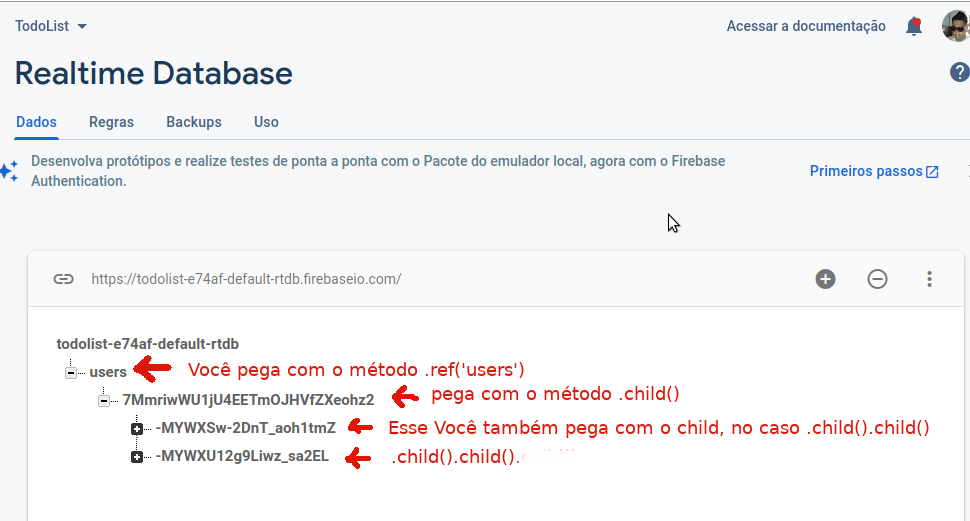
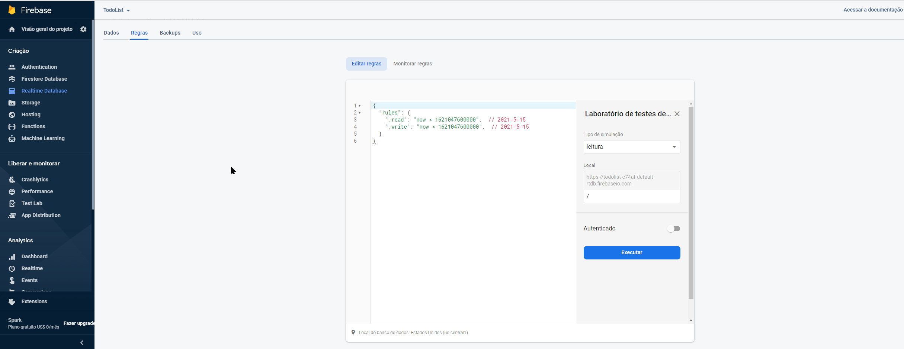
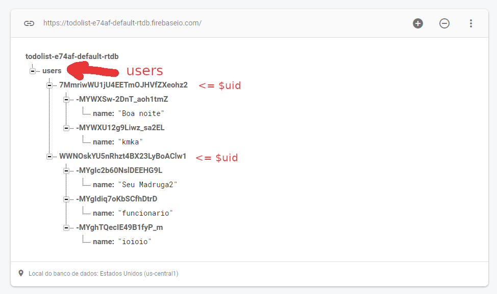
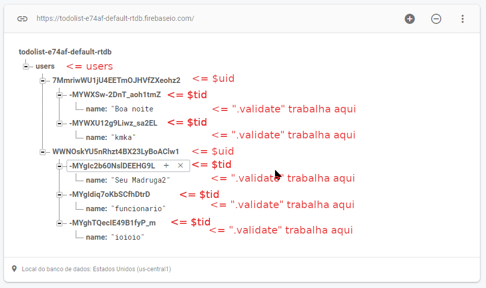
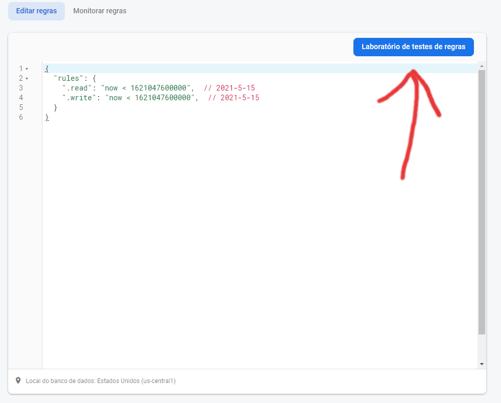
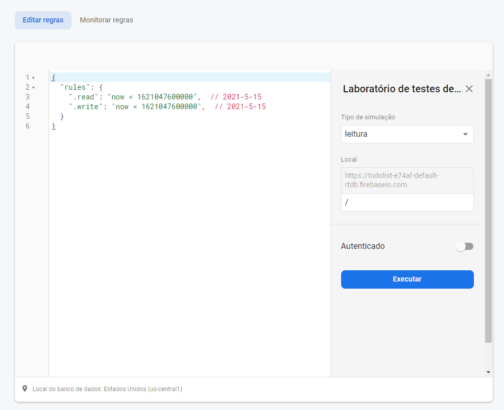

# Realtime Database

[1. Instalando o Firebase Realtime Database](#instalando-o-firebase-realtime-database)

[2. Implementando no projeto](#implementando-o-reatime-database-no-projeto)

[3. Adicionando Registro](#adicionando-registro)

[4. Removendo Registros](#removendo-registros)

[5. Atualizando registros](#atualizando-registros)

[6. Regras de Segurança](#configurando-regras-de-segurança-no-console-do-firebase)

[7. Filtrando e Classificando](#filtrando-e-classificando-dados-no-realtime-database)
## Instalando o Firebase Realtime Database
>O Firebase Realtime Database é um banco de dados NoSQL na nuvem que possibilita a sincronização de dados em tempo real no formato JSON.

### Configurar banco de dados

#### Opções de banco de dados
**Ao clicar no botão `criar banco de dados`, pelo menos por hora, você verá uma tela como essa abaixo, aonde você deve definir, em qual servidor ficará a aplicação.**

#### Regras de segurança

    

        
        
<b>O modo bloqueado é o modo padrão e recomendado para ambientes de produção, e obviamente recomendado</b>

    

     
    

        
        
<b>Nesse modo tanto a escrita como a leitura está liberado, não recomendado para ambiente de produção, mas útil em ambiente de desenvolvimento.</b>

    
    

#### Uma vez criado você verá uma tela como essa abaixo:

**Naqueles três pontinhos a direita, você tem um menu parecido com esse abaixo, como você pode perceber é possível importar arquivos do tipo JSON para cá, e para fazer backups automático, você precisa pagar por uma assinatura, pelo menos a mais básica.**

**Existe a opção de habilitar, as legenda para ter um melhor feedback visual dos dados.**

**Dessa forma abaixo, você pode adicionar coleções manualmente.**

### Adicionando Childs

    

        
        
<b>Quando você adiciona um campo sem valor, ele se torna um objeto, conforme ilustrado na imagem.</b>

    

     
    

        
        
<b>Porém quando você adiciona valor o campo passa a ser de um tipo primitivo.</b>

    
    

### E ao clicar em adicionar você tem:

## Implementando o Reatime Database no projeto
[Documentaçao](https://firebase.google.com/docs/database?authuser=0)
### Implementando o script
Para que o firebase funcione no seu projeto, usando o javascript vanilla, você precisará implementar o *javascript* correspondente: ``

### Usando objeto do método firebase.database()
> Para ler ou gravar dados no banco de dados, você precisa de uma instância de `firebase.database.Reference`:

    var database = firebase.database()

Um do objeto retornado tem o atributo `ref`, ao qual você pode usar para pegar uma coleção lá no banco de dados.

    firebase.database().ref('users')

No caso esse `users` desse método `ref`, faz referência a essa coleção aqui, lá no realtime database, conforme ilustrado na imagem abaixo:

Ou seja através do método `ref`, você pode pegar uma collection que está registrada lá no firebase.

### Pegando ID do usuário
Para pegar o **ID** da collection, através desse método `firebase.auth().currentUser.uid`, conforme ilustrado na imagem abaixo:

No caso esse método é pego dos registrados registrados, usando o `Firebase Authenticathion`. Nesse caso você pode associar os dados de um usuário autenticado com os dados no firebase conforme ilustrado abaixo:

### Pegando usuário
    const uid = firebase.auth().currentUser.uid;
    firebase
        .database()
        .ref('users')
        .child(uid)

No caso para registrar, você precisa identificar a coleção `.ref('users')`, após isso você precisa identificar o atributo dentro da coleção `.child(uid)`.

### firebase.database.Reference
[Documentação](https://firebase.google.com/docs/reference/js/firebase.database.Reference)

> Um objeto `Reference` representa um local específico em seu banco de dados e pode ser usado para leitura ou gravação de dados para esse banco de dados.

> Você pode referenciar o `root` ou local de um child em seu banco de dados chamando: `firebase.database().ref()` ou `firebase.database().ref("child/path")`.

> A escrita é feita com `set()` método e leitura podem ser feitos com o método `on()`.

### Método child
    Assinatura => `child ( path :  string ) : Reference`

>Path: um caminho relativo para essa localização para a localização do elemento filho desejado.

>Retorno: Pega um objeto `Reference` de um caminho especificado. 

### Método ref
>Pegando o objeto `Reference` da Raiz.
    var rootRef = firebase.database().ref();

>Pegando o objeto `Reference` de dentro de `users/ada`.
    var adaRef = firebase.database().ref("users/ada");

#### Usando o .ref e o .child

## Adicionando Registro
[Documentação](https://firebase.google.com/docs/reference/js/firebase.database.Reference#push)

    const uid = firebase.auth().currentUser.uid;
    firebase
        .database()
        .ref('users')
        .child(uid)
        .push({});

### Explicando
Para isso você precisa usar o método push para adicionar registro a nova coleção. No caso dentro do método `push` você deve adicionar o registro dentro da coleção, nesse exemplo acima seria enviado um objeto vazio.

###### Exemplo

    // Trata a submissão do formulário de autenticação
    todoForm.onsubmit = function (event) {
    event.preventDefault() // Evita o redirecionamento da página
        if (todoForm.name.value != '') {
            var data = {
            name: todoForm.name.value
            }

    const uid = firebase.auth().currentUser.uid; 
    dbRefUsers.child(uid).push(data).then(function (e) {
        console.log('Tarefa "' + data.name + '" adicionada com sucesso');
        console.log(e);
    })
    .catch(function(error){
        console.log("Erro no PUSH");
        console.log(error);
    });
    } else {
            alert('O nome da tarefa não pode ser em branco para criar a tarefa!')
        }
    }

#### Push
>`push`	aonde está `[metodo_abaixo]`: Adiciona a uma lista de dados no banco de dados e gera uma chave única, além de retornar objeto `Reference`, o que permite um encadeamento com outros métodos do tipo. Agora se você passa um valor como argumento, esse valor será usado para gerar a nova chave, caso você não o faça o próprio método fará isso. As chaves geradas são organizadas por ordem cronológica, o que resultará em uma lista de ítens ordenados cronológicamente. As chaves geradas automaticamente, são construídas para serem únicas e contém 72 bits gerados randomicamente.
###### Assinatura
    push ( value ? :  any ,  onComplete ? :  ( a :  Error | null ) => any ) : ThenableReference

## Removendo Registros
[Documentação](https://firebase.google.com/docs/reference/js/firebase.database.Reference#remove)
### remove
    firebase
        .database()
        .ref('users')
        .child(firebase.auth().currentUser.uid)
        .child(key)
        .remove()
        .then(() => console.log(`removendo ${key}...`))      
        .catch(error => console.log(error));

Para remover elementos,você pode usar o método `remove`, conforme visto aqui `.remove()`

###### Assinatura do remove
    remove ( onComplete ? :  ( a :  Error | null ) => any ) : Promise < any >

> Remove um banco de dados nessa localização, o evento `value` será imediatamente chamado e todos os registros serão excluídos ao mesmo tempo em todas as instâncias aonde a aplicação roda.

## Atualizando registros
[Documentação](https://firebase.google.com/docs/reference/js/firebase.database.Reference#update)
#### update
>Pode escrever muitos valores de uma só vez. Os `values` passados como argumentos devem estar estruturados como objetos javascript. Por exemplo, se você passar um atributo `name` com o seu valor no estilo `{name:'novo_valor'}`. Uso `.update({campo:'novo valor})'`.

###### Assinatura
    update ( values :  Object ,  onComplete ? :  ( a :  Error | null ) => any ) : Promise < any >

## Consultando Coleções
###### Analisando mudaças na coleção
    firebase
        .database()
        .ref('users')     
        .child(firebase.auth().currentUser.uid)
        .on('value',function(dataSnapShot){
            console.log(dataSnapShot);
            fillTodoList(dataSnapShot); //Funçao Abaixo
        });

Para você selecionar a coleção `.ref('users')`, acessando alguma conta de dentro da coleção `.child(firebase.auth().currentUser.uid)`, nesse caso está pegando o registro do usuário corrente, no caso sempre recomenda-se usar o *uid*, justamente para isso, pois esse valor é único para cada usuário e mais informações você pode ver [aqui](#pegando-id-do-usuário).

###### exibe a lista de tarefas do usuário
    function fillTodoList(dataSnapShot){
        ulTodoList.innerText = '';
        var num = dataSnapShot.numChildren();  
        //Exibe o numero de tarefas  
        todoCount.innerText = `${num} ${(num > 1)?'tarefas':'tarefa'+':'}`;
        dataSnapShot.forEach(function(item,index){
            var value = item.val();    
            var li = document.createElement('li');
            var spanLi = document.createElement('span');
            spanLi.appendChild(document.createTextNode(value.name));
            li.appendChild(spanLi);
            ulTodoList.appendChild(li);
            console.log('Tarefa:',index);
            console.log(item);
    });

### Método on
>Escuta dados de uma localização em particular.

>Esta é a principal maneira de ler dados de um banco de dados. Será acionado sempre que os dados serão alterados.

#### Evento: `value`
>Este evento acionará uma vez com os dados iniciais armazenados, em seguida, dispara novamente cada vez que os dados serão alterados. O `DataSnapshot` passado para callback passado no método `on` será usado, uma vez que seja chamado. Ele não será acionado até que todo o conteúdo esteja sincronizado. Se a coleção não tiver dados será retornado um `DataSnapshot` nulo.

    firebase
        .database()
        .ref('users')     
        .child(firebase.auth().currentUser.uid)
        .on('value',function(DataSnapshot){

        });

#### Evento: `child_added`
>Esse evento será chamado uma vez para cada filho, e será chamado denovo cada vez que um novo filho é adicionado. O `DataSnapshot` passado dentro da callback refletirá o dado para cada elemento filho relevante. O Segundo argumento será preenchido pela chave do elemento anterior, sendo nulo se for o primeiro elemento da coleção o alvo da mudança, isso serve para que você possa encadear com algum laço de repetição.
###### Exemplo
    firebase
        .database()
        .ref('users')     
        .child(firebase.auth().currentUser.uid)
        .on('child_added',function(DataSnapshot, prevChildKey){

        });

#### Evento: `child_removed`
>Esse evento é chamado toda vez que um elemento filho é removido. O `DataSnapshot` passado dentro da callback será o dado antigo que estava presente antes do elemento filho em questão ser removido. Um filho será removido quando:

**O cliente chama o método `remove()`, seja o elemento filho ou o pai.** 

**Quando o cliente chama `set(null)` nos elementos filhos ou nos ancestrais.**

**Quando um elemento filho tem todos os seus valores removidos.**

**Quando há uma consulta em vigor que filtra um elemento filho.**

    ref.on('child_removed', function(DataSnapshot) {
        ...
    });

#### Evento: `child_changed`
>Esse evento é disparado quando um dado armazenado em um elemento filho ou qualquer um dos seus descendentes mudam. Nota que um único evento `child_changed` representa muitas mudanças para os nós filhos. O `DataSnapshot` passado conterá os novos valores. O Segundo argumento será preenchido pela chave do elemento anterior, sendo nulo se for o primeiro elemento da coleção o alvo da mudança, isso serve para que você possa encadear com algum laço de repetição. 

    ref.on('child_changed', function(DataSnapshot, prevChildKey) {
        ...
    });

#### Evento: `child_moved`
>Esse evento é disparado quando um elemento filho muda de posição com relação aos seus siblings. O `DataSnapshot` conterá o dado que foi movido.O Segundo argumento será preenchido pela chave do elemento anterior, sendo nulo se for o primeiro elemento da coleção o alvo da mudança, isso serve para que você possa encadear com algum laço de repetição. 

    ref.on('child_moved', function(DataSnapshot, prevChildKey) {
        ...
    });
###### Assinatura
    on ( eventType :  EventType ,  callback :  ( a :  DataSnapshot ,  b ? :  string | null ) => any ,  cancelCallbackOrContext ? :  ( ( a :  Error ) => any ) | Object | null ,  context ? :  Object | null ) : ( a :  DataSnapshot | null ,  b ? :  string | null ) => any

## Configurando regras de Segurança no console do firebase
[Documentação base](https://firebase.google.com/docs/reference/security/database)

[Expressões regulares](https://firebase.google.com/docs/reference/security/database/regex)
### Explanação sobre essa parte
**Aqui você configura as regras do banco de dados, aqui você define o acesso ao firebase, nesse caso do exemplo abaixo, até a data extipulada abaixo o acesso é completo ao banco de dados a usuários autenticados e não autenticados, tanto de leitura como escrita.**

### Bloqueio completo

    {
        "rules": {
            ".read": false,
            ".write": false
        }
    }

Nesse modo o acesso ao banco de dados fica completamente bloqueado, no caso as regras do firebase funcionam com base em valores booleanos, se a expressão a direita de `.read` for falso, a leitura é proibida e se a expressão a direita de  `.write` for falsa a escrita é completamente vetada.

### Público
    {
        "rules": {
            ".read": true,
            ".write": true
        }
    }

Aqui acontece a situação oposto, isso é altamente perigoso para qualquer banco de dados, nesse exemplo acima qualquer um pode acessar os dados para leitura e escrita, mesmo que não esteja autenticado.

### Usuários autenticados
    {
      "rules": {
        ".read": "auth != null",
        ".write": "auth != null"
      }
    }

Nesse modo a leitura, assim como a escrita é vetada para usuários não logados na aplicação, porém uma vez logado os mesmos tem acessos a todos os dados, até mesmo os dados que não lhes pertençam.

#### auth
>Uma variável contendo a carga útil do token se um cliente for autenticado ou `null` se o cliente não for autenticado. O Firebase Realtime Database permite que você se autentique facilmente em vários provedores integrados e gera tokens de autenticação para eles. Depois que um usuário é autenticado com um dos provedores integrados, a variável auth conterá o seguinte:

>provider	O método de autenticação usado (por exemplo, "password", "anonymous", "facebook", "github", "google" ou "twitter"): Uso `auth.provider`.

>uid	Um ID de usuário único, com garantia de ser único em todos os provedores. Uso `auth.uid`

>token	O conteúdo do token de ID do Firebase Auth. Uso: `auth.token` Veja [auth.token](https://firebase.google.com/docs/reference/security/database#authtoken).

##### atributos para auth.token
>`email`:	O endereço de e-mail associado à conta, se houver.

>`email_verified`:	true se o usuário tiver verificado que tem acesso ao endereço de email - email . Alguns provedores verificam automaticamente os endereços de e-mail que possuem.

>`phone_number`:	O número de telefone associado à conta, se houver.

>`name`:	O nome de exibição do usuário, se definido.

>`sub`:	O UID do Firebase do usuário. Isso é único dentro de um projeto.

>`firebase.identities`:	Dicionário de todas as identidades associadas à conta deste usuário. As chaves do dicionário podem ser qualquer uma das seguintes: email - email , phone , google.com , facebook.com , github.com , twitter.com . Os valores do dicionário são matrizes de identificadores exclusivos para cada provedor de identidade associado à conta. Por exemplo, auth.token.firebase.identities["google.com"][0] contém o primeiro ID de usuário do Google associado à conta.

>`firebase.sign_in_provider`: O provedor de login usado para obter este token. Pode ser uma das seguintes strings: custom , password , phone , anonymous , google.com , facebook.com , github.com , twitter.com.

Exemplo de uso dessas variáveis acima: `auth.token.email`, `auth.token.email_verified`, `auth_name`, etc...

### Rules complexo
    {
        "rules": {
            "users": {
                "$uid": {
                    ".read": "$uid == auth.uid",
                        ".write": "$uid == auth.uid"
                }
            }
        }
    }

#### Sobre variaveis
Você pode criar uma variável colocando o cifrão na frente, nesse caso estamos dizendo que temos uma variável  que faz referência a aquele nível hierárquico no documento, conforme visto aqui `"$uid": {` e logo essa variável pode ser usado dentro do seu próprio escopo, conforme visto aqui `".read": "$uid == auth.uid"` e aqui `".write": "$uid == auth.uid"`, nesse caso, estamos verificando se o valor aqui `$uid` bate com o do usuário logado aqui `auth.uid`, se bater a escrita e leitura é permitida. No caso isso evita que o usuário edite o conteúdo dos outros, uma vez que se ele tentar o valor dessa variável `$uid` será diferente de `auth.uid` e essa expressão resultará em falso, o que por fim irá resultar no bloqueio. No caso quando o valor pode alterar, você pode usar o `$`, no caso desse exemplo printado o `$uid` poderá ser `7MmriwWU1jU4EETmOJHVfZXeohz2` ou `WWNOskYU5nRhzt4BX23LyBoAClw1`, logo devido a essa alteração, pode-se usar uma variável com nome qualquer para indicar `7MmriwWU1jU4EETmOJHVfZXeohz2` ou `WWNOskYU5nRhzt4BX23LyBoAClw1`, dependendo de quem está logado, já como o nome da coleção não se altera, então você pode colocar um nome de uma forma estática, conforme visto aqui `"users": {`, resumindo se no caminho, tiver alguma parte da url que varia, você usa variáveis com cifrão na frente e na parte estática da rota, você pode colocar de maneira estática, conforme o `users` ali.

### Regras para validações

    {
        "rules": {
                "users": {
                    "$uid": {
                        ".read": "$uid == auth.uid",
                        ".write": "$uid == auth.uid",
                        "$tid": {
                            ".validate": "newData.child('name').isString() && newData.child('name').val().length <= 30"
                        }
                    }
                }
            }
    }

#### .validate
[Documentação](https://firebase.google.com/docs/reference/security/database#validate)
>Usado quando uma regra `.write` concede acesso, para garantir que os dados que estão sendo gravados estejam em conformidade com um esquema específico. Uma regra `.validate` é usada quando uma regra `.write` concede acesso, para garantir que os dados que estão sendo gravados estejam em conformidade com um padrão específico. Além de um `.write` conceder acesso, todas as regras `.validate` relevantes devem ser bem-sucedidas antes que uma gravação seja permitida. Por exemplo:

    ".validate": "newData.hasChildren(['name', 'age'])"

>O valor de uma regra `.validate` é uma string, que é avaliada como um subconjunto da sintaxe da expressão do JavaScript com algumas mudanças comportamentais para aumentar a clareza e a correção.

>Uma regra .validate tem acesso a todas as [variaveis de regras](https://firebase.google.com/docs/reference/security/database#variables) do Firebase Realtime Database.

##### newData
>Para `.write` e `.validate`, a variável `newData` dá-lhe uma [RuleDataSnapshot](https://firebase.google.com/docs/reference/security/database#ruledatasnapshot_methods) correspondente aos dados que resultarão, caso a gravação seja permitido (que é uma "fusão" dos dados existentes, mais os novos dados sendo escrito). Portanto, se você quiser garantir que cada usuário tenha um nome e idade, poderá usar:

    {
        "rules": {
            "users": {
                "$user": {
                    ".read": true,
                    ".write": true,
                    ".validate": "newData.hasChildren(['name', 'age'])"
                }
            }
        }
    }

>A variável `newData` não está disponível nas regras `.read` , pois não há novos dados sendo gravados.

##### Método isString

>Retorna verdadeiro se este [RuleDataSnapshot](https://firebase.google.com/docs/reference/security/database#ruledatasnapshot_methods) contiver um valor de string. Valor de retorno : Boolean - `true` se os dados forem uma String ; se não for `false`.

##### método child
>Obtém um [RuleDataSnapshot](https://firebase.google.com/docs/reference/security/database#ruledatasnapshot_methods) para o local no caminho relativo especificado.

>Argumentos : childPath String - Um caminho relativo para a localização dos dados filho.

>Valor de retorno : RuleDataSnapshot - O RuleDataSnapshot para o local filho.

>O caminho relativo pode ser um nome filho simples (por exemplo, 'fred') ou um caminho separado por barras mais profundas (por exemplo, 'fred / nome / primeiro'). Se o local filho não tiver dados, um [RuleDataSnapshot](https://firebase.google.com/docs/reference/security/database#ruledatasnapshot_methods) vazio será retornado.

##### método val

>Obtém o valor primitivo ( string , number , boolean ou null ) deste [RuleDataSnapshot](https://firebase.google.com/docs/reference/security/database#ruledatasnapshot_methods) .

>Valor de retorno : ( String , Number , Boolean , Null ) - O valor primitivo deste [RuleDataSnapshot](https://firebase.google.com/docs/reference/security/database#ruledatasnapshot_methods) .

>Ao contrário de `DataSnapshot.val()` , chamar `val()` em um [RuleDataSnapshot](https://firebase.google.com/docs/reference/security/database#ruledatasnapshot_methods) que possui dados filho não retornará um objeto contendo os filhos. Em vez disso, ele retornará um valor sentinela especial. Isso garante que as regras sempre possam operar com extrema eficiência.

>Como consequência, você deve sempre usar `child()` para acessar filhos (por exemplo, `data.child('name').val()` , não `data.val().name` ).

##### Atributo length

>Retorna o comprimento da string. Valor de retorno : Number - O número de caracteres na string.

### Laboratórios de Regras

**Você pode clicar nesse botão do print abaixo, para que o labarotório de regras seja exibido e você possa testar como as regras estão funcionando.**

**Ao fazer isso deve-se abrir uma janela como esta abaixo:**

## Filtrando e Classificando dados no Realtime Database
###### Código de exemplo para filtro e classificação
    if(search.value != ""){
      dbRefUsers
        .child(user.uid)
        .orderByChild('name') //Ordena as tarefas com base no nome e em ordem alfabética crescente.
        .startAt(search.value).endAt(search.value + '\uf8ff') //Delimita os resultados, que comecem com o termo pesquisado
        .once('value') //Executa a busca apenas uma vez.
        .then(function(dataSnapShot){
          fillTodoList(dataSnapShot);
          console.log(dataSnapShot);
        })
    }else{
      getDefaultTodoList()
    }

    //Buscar tarefas em tempo real (Listagem padrão, usando o on)
    function getDefaultTodoList(){
        dbRefUsers
            .child(firebase.auth().currentUser.uid)
            .orderByChild('name')
            .on('value',function(dataSnapShot){
                fillTodoList(dataSnapShot);
                console.log(dataSnapShot);
            })
    }

### Método once

>Ouve exatamente um evento do tipo de evento especificado e, em seguida, para de ouvir.

>Isso é equivalente a chamar `on()`, e então chamar `off()` Dentro da função callback. Veja a documentação de [on()](#método-on) Para detalhes sobre os tipos de eventos.

>Os eventos podem ser: "value", "child_added", "child_changed", "child_removed", or "child_moved."

###### Assinatura do método once
    nce ( eventType :  EventType ,  successCallback ? :  ( a :  DataSnapshot ,  b ? :  string | null ) => any ,  failureCallbackOrContext ? :  ( ( a :  Error ) => void ) | Object | null ,  context ? :  Object | null ) : Promise < DataSnapshot >

No caso o evento `on` e `once` funciona como o padrão da biblioteca `event emitter` do javascript, com base nisso, o `on` cria um canal com o firebase e fica escutando qualquer alteração que aconteça, executando assim uma *callback*, ao passo que o `once` é chamado apenas uma vez e executando a callback encadeada no *then* ou no *catch*.

###### Once Promise
    ...
    .once('value') //Executa a busca apenas uma vez.
        .then(function(dataSnapShot){
          fillTodoList(dataSnapShot);
          console.log(dataSnapShot);
        })

###### On Callback

    ...
    .on('value',function(dataSnapShot){
                fillTodoList(dataSnapShot);
                console.log(dataSnapShot);
            })

### Método orderByChild

[Documentação](https://firebase.google.com/docs/reference/js/firebase.database.Reference#orderbychild)

>Gera um novo objeto de consulta ordenado pela chave. Consultas só podem submeter uma chave de cada vez, chamando `orderByChild()` multiplas vezes na mesma query gerará um erro.
###### Assinatura
    orderByChild ( path :  string ) : Query

Esse método permite ordenação no banco de dados, o `Realtime Database` nesse quisito é bem rudimentar, ao ponto que ordenação inversa por exemplo, não é suportado. Dentro dos parenteses você deve adicionar o nome do campo ou o path da collection para que a ordenação seja feita sempre de maneira crescente, com base no campo passado. Também existe o [orderByKey](https://firebase.google.com/docs/reference/js/firebase.database.Reference#orderbykey), [orderByPriority](https://firebase.google.com/docs/reference/js/firebase.database.Reference#orderbypriority) e [orderByValue](https://firebase.google.com/docs/reference/js/firebase.database.Reference#orderbyvalue), caso essa opção não te sirva.

### startAt
[Documentação](https://firebase.google.com/docs/reference/js/firebase.database.Reference#startat)

>Cria uma consulta com base no ponto de partida especificado.

>Usando [startAt()](https://firebase.google.com/docs/reference/js/firebase.database.Reference#startat), [startAfter()](https://firebase.google.com/docs/reference/js/firebase.database.Reference#startafter), [endBefore()](https://firebase.google.com/docs/reference/js/firebase.database.Reference#endbefore), [endAt()](https://firebase.google.com/docs/reference/js/firebase.database.Reference#endat) and [equalTo()](https://firebase.google.com/docs/reference/js/firebase.database.Reference#equalto) Permite que você escolha pontos de partida e finais arbitrários para suas consultas.

###### Assinatura
    startAt ( value :  number | string | boolean | null ,  key ? :  string ) : Query

>O ponto de partida é inclusivo, então os `childs` com o valor especificado serão inclusos na consulta. O argumento `key`, que é opcional pode ser usado para limitar ainda mais o intervalo da consulta. Se for especificado, então os `childs` tem que ser o exato valor especificado.

### endAt
[Documentação](https://firebase.google.com/docs/reference/js/firebase.database.Reference#endat)

>Cria uma consulta com o ponto final especificado.

>Usando [startAt()](https://firebase.google.com/docs/reference/js/firebase.database.Reference#startat), [startAfter()](https://firebase.google.com/docs/reference/js/firebase.database.Reference#startafter), [endBefore()](https://firebase.google.com/docs/reference/js/firebase.database.Reference#endbefore), [endAt()](https://firebase.google.com/docs/reference/js/firebase.database.Reference#endat) and [equalTo()](https://firebase.google.com/docs/reference/js/firebase.database.Reference#equalto) Permite que você escolha pontos de partida e finais arbitrários para suas consultas.

>O ponto final é inclusivo, então os `childs` com o valor especificado será incluído na consulta. O argumento `key` opcional pode ser usado para limitar ainda mais o intervalo da consulta. Se for especificado, então os `childs` tem que ser o exato valor especificado.
###### Assinatura
    endAt ( value :  number | string | boolean | null ,  key ? :  string ) : Query
