# Realtime Database

[1. Instalando o Firebase Realtime Database](#instalando-o-firebase-realtime-database)

[2. Implementando no projeto](#implementando-o-reatime-database-no-projeto)

[3. Adicionando Registro](#adicionando-registro)

[4. Removendo Registros](#removendo-registros)
## Instalando o Firebase Realtime Database
>O Firebase Realtime Database é um banco de dados NoSQL na nuvem que possibilita a sincronização de dados em tempo real no formato JSON.

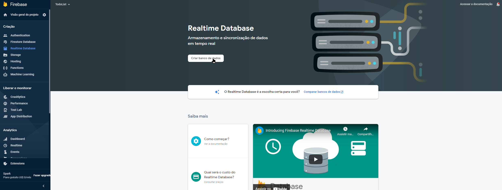

### Configurar banco de dados

#### Opções de banco de dados
**Ao clicar no botão `criar banco de dados`, pelo menos por hora, você verá uma tela como essa abaixo, aonde você deve definir, em qual servidor ficará a aplicação.**

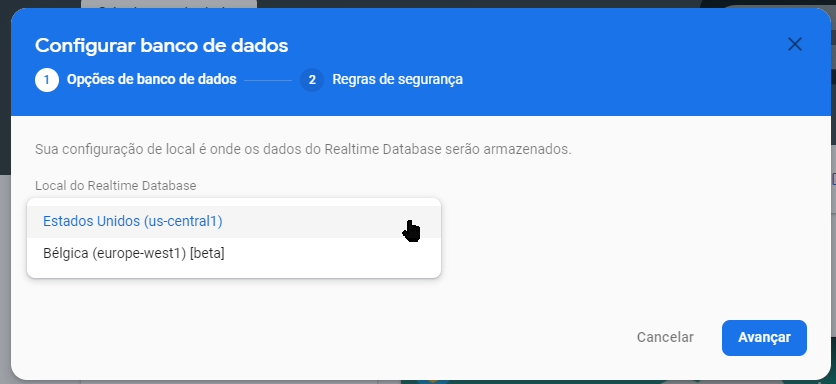

#### Regras de segurança

    

        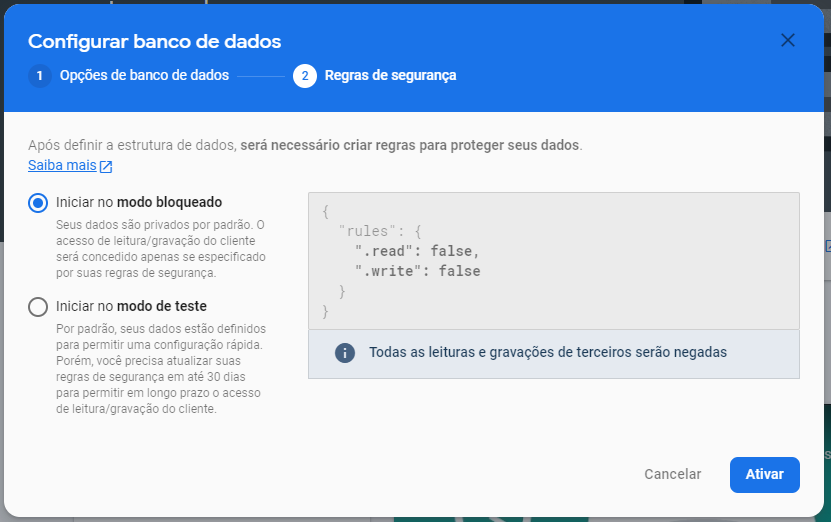
        
<b>O modo bloqueado é o modo padrão e recomendado para ambientes de produção, e obviamente recomendado</b>

    

     
    

        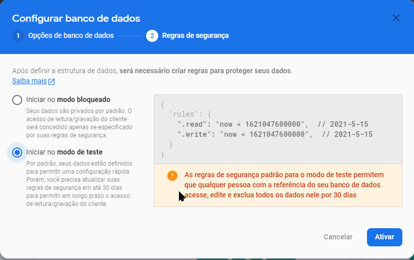
        
<b>Nesse modo tanto a escrita como a leitura está liberado, não recomendado para ambiente de produção, mas útil em ambiente de desenvolvimento.</b>

    
    

#### Uma vez criado você verá uma tela como essa abaixo:

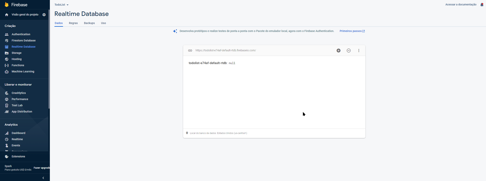

**Naqueles três pontinhos a direita, você tem um menu parecido com esse abaixo, como você pode perceber é possível importar arquivos do tipo JSON para cá, e para fazer backups automático, você precisa pagar por uma assinatura, pelo menos a mais básica.**

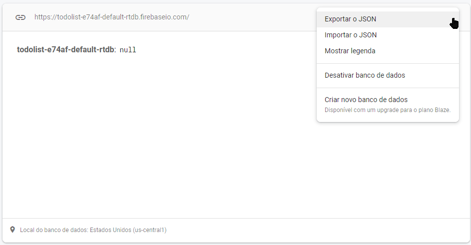

**Existe a opção de habilitar, as legenda para ter um melhor feedback visual dos dados.**

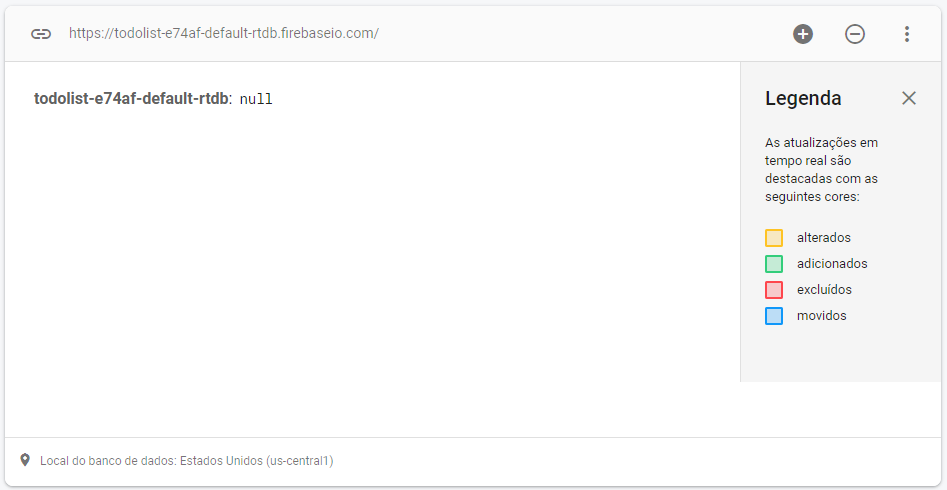

**Dessa forma abaixo, você pode adicionar coleções manualmente.**

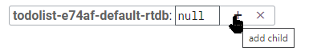

### Adicionando Childs

    

        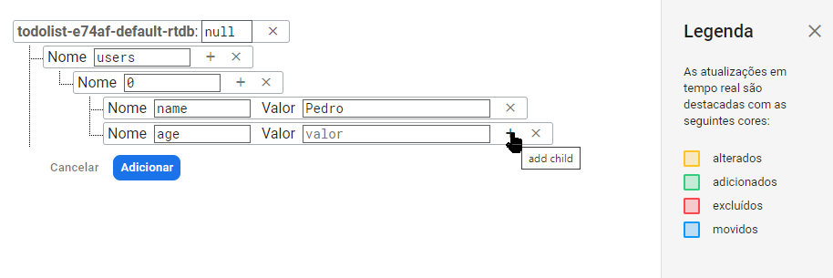
        
<b>Quando você adiciona um campo sem valor, ele se torna um objeto, conforme ilustrado na imagem.</b>

    

     
    

        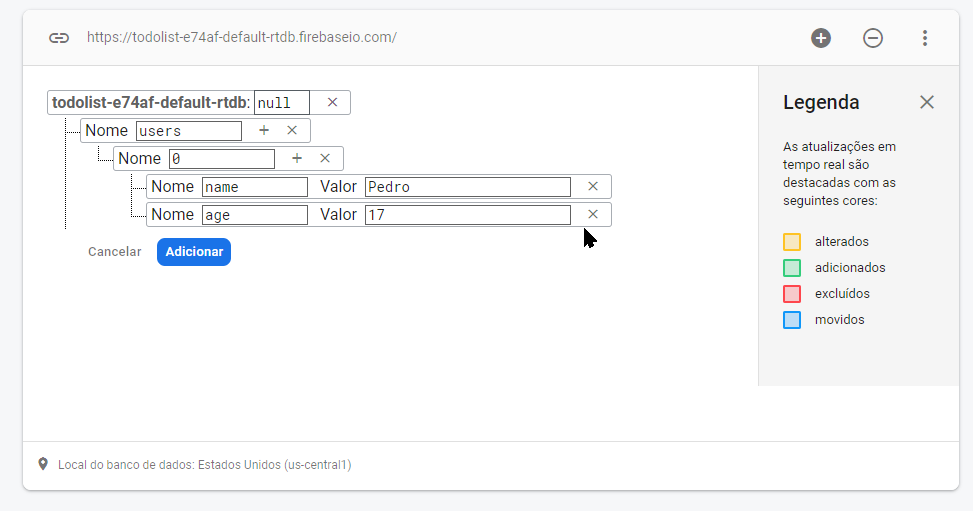
        
<b>Porém quando você adiciona valor o campo passa a ser de um tipo primitivo.</b>

    
    

### E ao clicar em adicionar você tem:

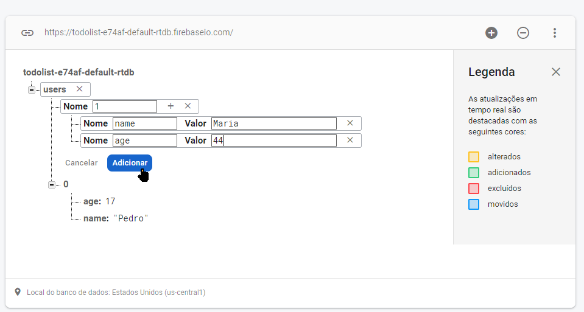

## Implementando o Reatime Database no projeto
[Documentaçao](https://firebase.google.com/docs/database?authuser=0)
### Implementando o script
Para que o firebase funcione no seu projeto, usando o javascript vanilla, você precisará implementar o *javascript* correspondente: ``

### Usando objeto do método firebase.database()
> Para ler ou gravar dados no banco de dados, você precisa de uma instância de `firebase.database.Reference`:

    var database = firebase.database()

Um do objeto retornado tem o atributo `ref`, ao qual você pode usar para pegar uma coleção lá no banco de dados.

    firebase.database().ref('users')

No caso esse `users` desse método `ref`, faz referência a essa coleção aqui, lá no realtime database, conforme ilustrado na imagem abaixo:

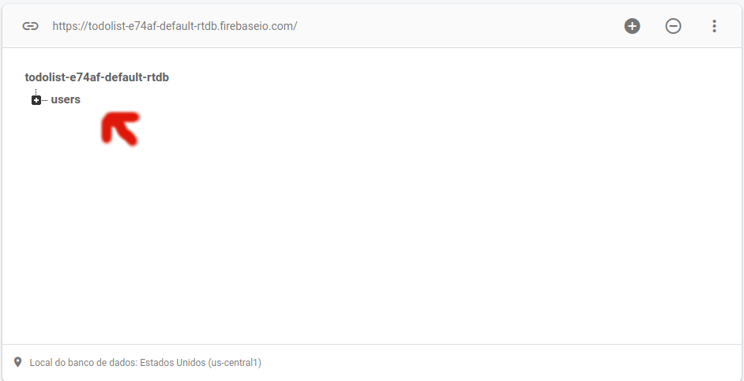

Ou seja através do método `ref`, você pode pegar uma collection que está registrada lá no firebase.

### Pegando ID do usuário
Para pegar o **ID** da collection, através desse método `firebase.auth().currentUser.uid`, conforme ilustrado na imagem abaixo:

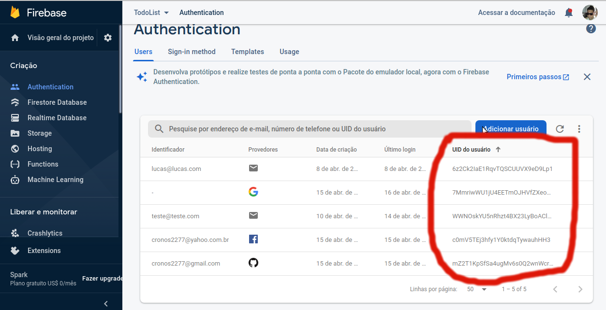

No caso esse método é pego dos registrados registrados, usando o `Firebase Authenticathion`. Nesse caso você pode associar os dados de um usuário autenticado com os dados no firebase conforme ilustrado abaixo:

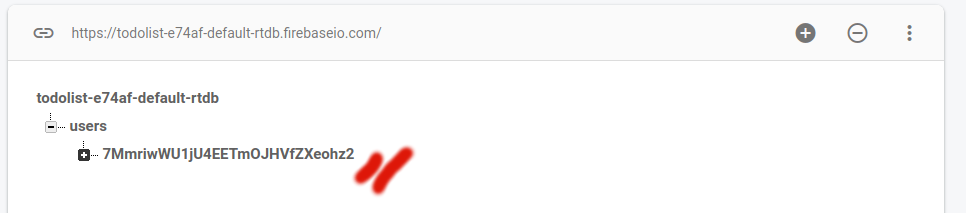

### Pegando usuário
    const uid = firebase.auth().currentUser.uid;
    firebase
        .database()
        .ref('users')
        .child(uid)

No caso para registrar, você precisa identificar a coleção `.ref('users')`, após isso você precisa identificar o atributo dentro da coleção `.child(uid)`.

### firebase.database.Reference
[Documentação](https://firebase.google.com/docs/reference/js/firebase.database.Reference)

> Um objeto `Reference` representa um local específico em seu banco de dados e pode ser usado para leitura ou gravação de dados para esse banco de dados.

> Você pode referenciar o `root` ou local de um child em seu banco de dados chamando: `firebase.database().ref()` ou `firebase.database().ref("child/path")`.

> A escrita é feita com `set()` método e leitura podem ser feitos com o método `on()`.

### Método child
    Assinatura => `child ( path :  string ) : Reference`

>Path: um caminho relativo para essa localização para a localização do elemento filho desejado.

>Retorno: Pega um objeto `Reference` de um caminho especificado. 

### Método ref
>Pegando o objeto `Reference` da Raiz.
    var rootRef = firebase.database().ref();

>Pegando o objeto `Reference` de dentro de `users/ada`.
    var adaRef = firebase.database().ref("users/ada");

#### Usando o .ref e o .child
[Ref Child](./.img/ref_child.png)

## Adicionando Registro
[Documentação](https://firebase.google.com/docs/reference/js/firebase.database.Reference#push)

    const uid = firebase.auth().currentUser.uid;
    firebase
        .database()
        .ref('users')
        .child(uid)
        .push({});

### Explicando
Para isso você precisa usar o método push para adicionar registro a nova coleção. No caso dentro do método `push` você deve adicionar o registro dentro da coleção, nesse exemplo acima seria enviado um objeto vazio.

###### Exemplo

    // Trata a submissão do formulário de autenticação
    todoForm.onsubmit = function (event) {
    event.preventDefault() // Evita o redirecionamento da página
        if (todoForm.name.value != '') {
            var data = {
            name: todoForm.name.value
            }

    const uid = firebase.auth().currentUser.uid; 
    dbRefUsers.child(uid).push(data).then(function (e) {
        console.log('Tarefa "' + data.name + '" adicionada com sucesso');
        console.log(e);
    })
    .catch(function(error){
        console.log("Erro no PUSH");
        console.log(error);
    });
    } else {
            alert('O nome da tarefa não pode ser em branco para criar a tarefa!')
        }
    }

#### Push
>`push`	aonde está `[metodo_abaixo]`: Adiciona a uma lista de dados no banco de dados e gera uma chave única, além de retornar objeto `Reference`, o que permite um encadeamento com outros métodos do tipo. Agora se você passa um valor como argumento, esse valor será usado para gerar a nova chave, caso você não o faça o próprio método fará isso. As chaves geradas são organizadas por ordem cronológica, o que resultará em uma lista de ítens ordenados cronológicamente. As chaves geradas automaticamente, são construídas para serem únicas e contém 72 bits gerados randomicamente.
###### Assinatura
    push ( value ? :  any ,  onComplete ? :  ( a :  Error | null ) => any ) : ThenableReference

## Removendo Registros
[Documentação](https://firebase.google.com/docs/reference/js/firebase.database.Reference#remove)
### remove
    firebase
        .database()
        .ref('users')
        .child(firebase.auth().currentUser.uid)
        .child(key)
        .remove()
        .then(() => console.log(`removendo ${key}...`))      
        .catch(error => console.log(error));

Para remover elementos,você pode usar o método `remove`, conforme visto aqui `.remove()`

###### Assinatura do remove
    remove ( onComplete ? :  ( a :  Error | null ) => any ) : Promise < any >

> Remove um banco de dados nessa localização, o evento `value` será imediatamente chamado e todos os registros serão excluídos ao mesmo tempo em todas as instâncias aonde a aplicação roda.

## Atualizando registros
[Documentação](https://firebase.google.com/docs/reference/js/firebase.database.Reference#update)
#### update
>Pode escrever muitos valores de uma só vez. Os `values` passados como argumentos devem estar estruturados como objetos javascript. Por exemplo, se você passar um atributo `name` com o seu valor no estilo `{name:'novo_valor'}`. Uso `.update({campo:'novo valor})'`.

###### Assinatura
    update ( values :  Object ,  onComplete ? :  ( a :  Error | null ) => any ) : Promise < any >

## Consultando Coleções
###### Analisando mudaças na coleção
    firebase
        .database()
        .ref('users')     
        .child(firebase.auth().currentUser.uid)
        .on('value',function(dataSnapShot){
            console.log(dataSnapShot);
            fillTodoList(dataSnapShot); //Funçao Abaixo
        });

Para você selecionar a coleção `.ref('users')`, acessando alguma conta de dentro da coleção `.child(firebase.auth().currentUser.uid)`, nesse caso está pegando o registro do usuário corrente, no caso sempre recomenda-se usar o *uid*, justamente para isso, pois esse valor é único para cada usuário e mais informações você pode ver [aqui](#pegando-id-do-usuário).

###### exibe a lista de tarefas do usuário
    function fillTodoList(dataSnapShot){
        ulTodoList.innerText = '';
        var num = dataSnapShot.numChildren();  
        //Exibe o numero de tarefas  
        todoCount.innerText = `${num} ${(num > 1)?'tarefas':'tarefa'+':'}`;
        dataSnapShot.forEach(function(item,index){
            var value = item.val();    
            var li = document.createElement('li');
            var spanLi = document.createElement('span');
            spanLi.appendChild(document.createTextNode(value.name));
            li.appendChild(spanLi);
            ulTodoList.appendChild(li);
            console.log('Tarefa:',index);
            console.log(item);
    });

### Método on
>Escuta dados de uma localização em particular.

>Esta é a principal maneira de ler dados de um banco de dados. Será acionado sempre que os dados serão alterados.

#### Evento: `value`
>Este evento acionará uma vez com os dados iniciais armazenados, em seguida, dispara novamente cada vez que os dados serão alterados. O `DataSnapshot` passado para callback passado no método `on` será usado, uma vez que seja chamado. Ele não será acionado até que todo o conteúdo esteja sincronizado. Se a coleção não tiver dados será retornado um `DataSnapshot` nulo.

    firebase
        .database()
        .ref('users')     
        .child(firebase.auth().currentUser.uid)
        .on('value',function(DataSnapshot){

        });

#### Evento: `child_added`
>Esse evento será chamado uma vez para cada filho, e será chamado denovo cada vez que um novo filho é adicionado. O `DataSnapshot` passado dentro da callback refletirá o dado para cada elemento filho relevante. O Segundo argumento será preenchido pela chave do elemento anterior, sendo nulo se for o primeiro elemento da coleção o alvo da mudança, isso serve para que você possa encadear com algum laço de repetição.
###### Exemplo
    firebase
        .database()
        .ref('users')     
        .child(firebase.auth().currentUser.uid)
        .on('child_added',function(DataSnapshot, prevChildKey){

        });

#### Evento: `child_removed`
>Esse evento é chamado toda vez que um elemento filho é removido. O `DataSnapshot` passado dentro da callback será o dado antigo que estava presente antes do elemento filho em questão ser removido. Um filho será removido quando:

**O cliente chama o método `remove()`, seja o elemento filho ou o pai.** 

**Quando o cliente chama `set(null)` nos elementos filhos ou nos ancestrais.**

**Quando um elemento filho tem todos os seus valores removidos.**

**Quando há uma consulta em vigor que filtra um elemento filho.**

    ref.on('child_removed', function(DataSnapshot) {
        ...
    });

#### Evento: `child_changed`
>Esse evento é disparado quando um dado armazenado em um elemento filho ou qualquer um dos seus descendentes mudam. Nota que um único evento `child_changed` representa muitas mudanças para os nós filhos. O `DataSnapshot` passado conterá os novos valores. O Segundo argumento será preenchido pela chave do elemento anterior, sendo nulo se for o primeiro elemento da coleção o alvo da mudança, isso serve para que você possa encadear com algum laço de repetição. 

    ref.on('child_changed', function(DataSnapshot, prevChildKey) {
        ...
    });

#### Evento: `child_moved`
>Esse evento é disparado quando um elemento filho muda de posição com relação aos seus siblings. O `DataSnapshot` conterá o dado que foi movido.O Segundo argumento será preenchido pela chave do elemento anterior, sendo nulo se for o primeiro elemento da coleção o alvo da mudança, isso serve para que você possa encadear com algum laço de repetição. 

    ref.on('child_moved', function(DataSnapshot, prevChildKey) {
        ...
    });
###### Assinatura
    on ( eventType :  EventType ,  callback :  ( a :  DataSnapshot ,  b ? :  string | null ) => any ,  cancelCallbackOrContext ? :  ( ( a :  Error ) => any ) | Object | null ,  context ? :  Object | null ) : ( a :  DataSnapshot | null ,  b ? :  string | null ) => any